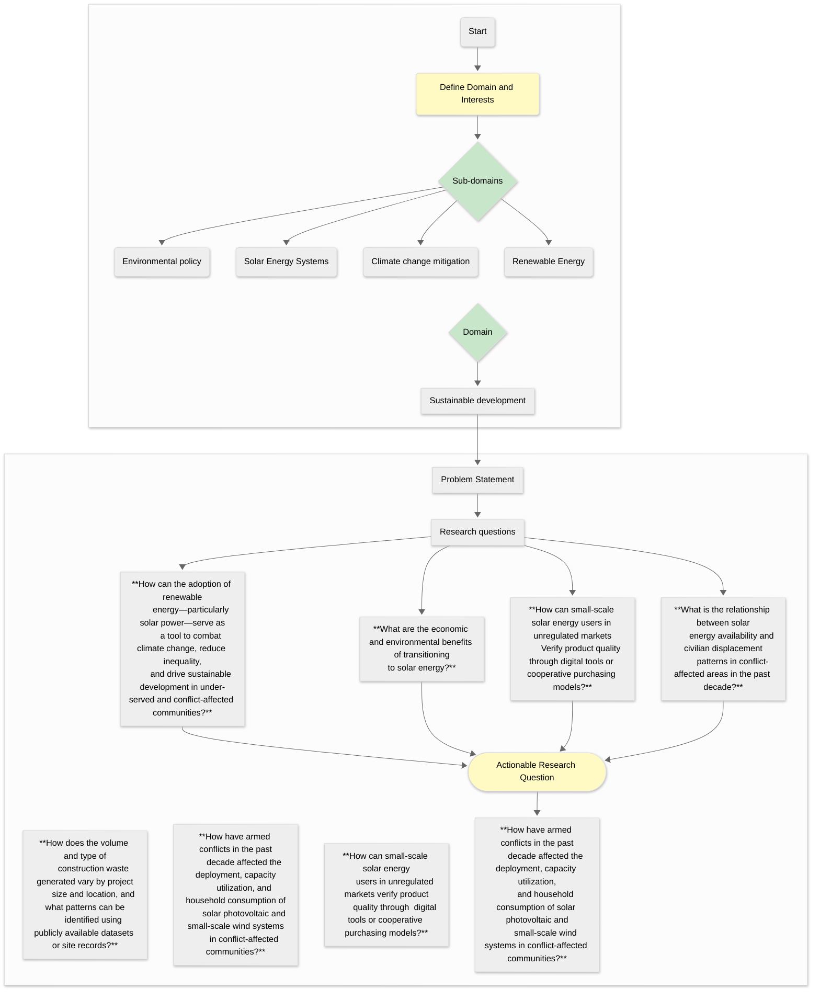

# Team Progress

## Convergent and divergent thinking

### Problem Identification

## Constraints

- Geographical and Seasonal Limitations
  - Limited sunlight hours and seasonal variation in some regions
- Financial Barriers
  - High initial cost of solar panel installation
- Infrastructure Challenges
  - Lack of storage infrastructure (e.g. batteries)
- Energy Access Disparities
  - Uneven access to renewable energy across urban and rural areas
- Time Constraints
  - Time limit of 12 weeks for research
- Knowledge Requirements
  - Requires basic domain knowledge in climate science and energy policy
