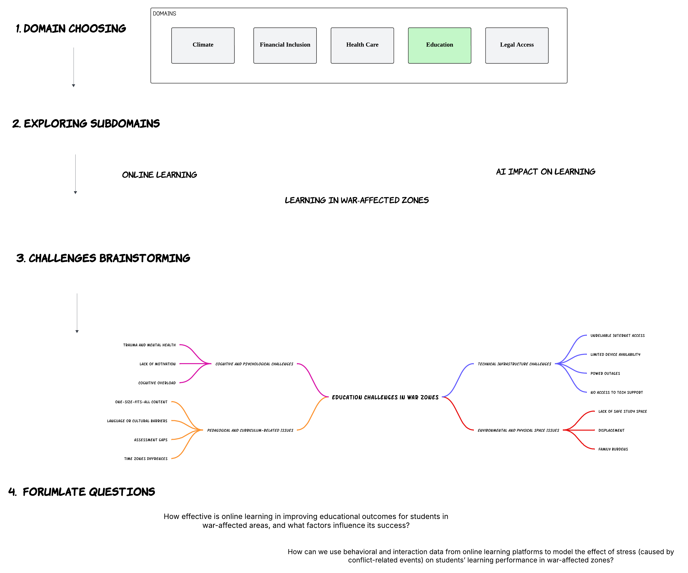

# Workflow
We have applied ***Divergent*** and ***Convergent*** thinking back and forth during our ***Thinking*** & ***Brainstorming*** workflow

## 1. Choosing a domain of interest

### Process

* A poll has been set up as a pre-meeting activity for 2025-06-06 meeting.\
 You can check out the vote in the [meetting agenda](https://docs.google.com/document/d/1zahZ02WABX2AjxJR1ysF6Vk9mBteEcLbklt6Sd2x0-g/edit?usp=sharing). ***Divergent***: we have suggested all possible domains.
* All of the team members have agreed on **Education** Domain. ***Convergent***: we narrowed down the possible domains to just one.

## 2. Exploring Sub Domains

### Process

* Each teammember has shared with the team their ***Personal Experience*** in the **Education** domain in their commuitites.
* Based on the personl experiences we have agreed on top headlines we want to explore further,\
  **Headlines** include:
  1.  Online learning in war affected areas.
  2.  Impact of AI on online learning.
  3.  Challenges of online learning.
  4.  Design the online learning experience better (How to)
* Then we have set up a search task for each team member regarding these headlines.

