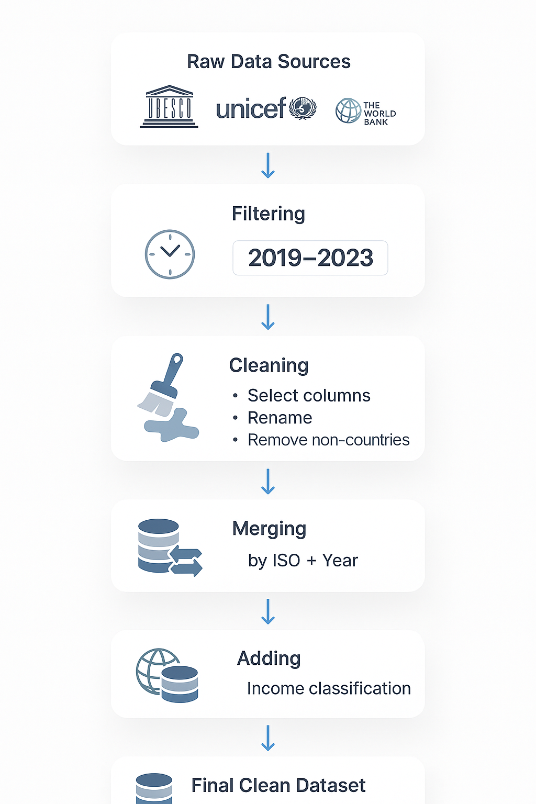

# 📂 Datasets Documentation

This folder contains all the datasets used to model the impact of
 the COVID-19 pandemic on math learning outcomes in primary education.  
Most of our data was collected from **UNESCO's UIS (Institute for Statistics)**
 open data platform. To add important contextual variables, we included supplementary
  datasets from **UNICEF** and the **World Bank**.

---

## 🎯 Research Question

**How did the COVID-19 pandemic affect math learning outcomes in primary  
education systems across countries of different income levels,  
and what policy responses can support recovery?**

---

## 🔄 Research Question Adjustment

Our original focus was on **low- and middle-income countries (LMICs)** only:

> *“How did students in low- and middle-income countries experience changes  
in their learning proficiency during the COVID-19 pandemic, and what kind of  
support systems can address those gaps effectively?”*

We adjusted the scope and phrasing of the question to:

> **“How did the COVID-19 pandemic affect math learning outcomes in primary  
education systems across countries of different income levels, and what policy  
responses can support recovery?”**

### Why the adjustment?

1. **Data availability constraints**: We found limited assessment
    data for LMICs, especially during 2020–2021. Expanding to include all income
     groups ensured more consistent and complete data coverage.

2. **Comparative value**: By classifying countries by income level, we could
    still highlight LMIC challenges while enabling global comparisons.

---

## 🧠 Modeling Approach

To model the impact of COVID-19 on primary-level math learning outcomes,  
we relied on **country-level education system indicators** instead of
 individual student-level data.  
This was due to data privacy concerns and the scarcity of standardized
 testing during the pandemic.

Our dependent variable is:

- **Proportion of students achieving minimum math proficiency
   at the end of primary school**

Our independent variables include:

- Government expenditure on education (% of GDP)
- Completion rate of primary education
- Out-of-school rate (primary level)
- Pupil-to-trained-teacher ratio
- Digital connectivity for school-age children
- Duration of school closures

Countries are grouped by World Bank income levels for comparative analysis.

*Figure: Data flow and feature grouping used to model COVID-related learning loss.*

---

## ⚠️ Constraints and Limitations

- **Lack of standardized assessment data for 2020–2021**
- **Missing data** for some countries and years
- **Some indicators are modeled**, not directly observed (e.g., completion rate)
- **No individual-level data**
- **Definitions of “school closures” vary**
- **Digital connectivity estimates** are based on the most recent
   household survey available (often pre-2020)

---

## 📊 Dataset Summary

| # | Variable                  | Description                                              | Source     | Time Range   |
|---|---------------------------|----------------------------------------------------------|------------|--------------|
| 1 | `math_proficiency`        | % of students achieving minimum level                   | UNESCO UIS | 2019–2023    |
| 2 | `gov_edu_spending`        | Government spending on education (% of GDP)             | UNESCO     | 2019–2023    |
| 3 | `completion_rate`         | % completing primary education                          | UNESCO     | 2019–2023    |
| 4 | `out_of_school_rate`      | % of primary-aged children not enrolled                 | UNESCO     | 2019–2023    |
| 5 | `trained_teacher_ratio`   | Pupils per trained teacher                              | UNESCO     | 2019–2023    |
| 6 | `digital_connectivity`    | % of school-age children with digital access (latest)   | UNICEF     | 2010–2020    |
| 7 | `school_closure`          | Number of days schools were closed (full/partial)       | UNESCO     | 2020–2022    |

---

## 🔁 Reproducibility

- 📁 Raw data in: `datasets/raw_data/`  
- 📁 Cleaned individual files in: `datasets/cleaned_data/`  
- 📜 Cleaning/merging script: `scripts/data_cleaning_script.ipynb`  
- 📄 Final dataset: `datasets/final_dataset.csv`  
- 🌍 All countries identified by ISO 3-letter codes  
- ⛔ Missing values preserved as `NaN` to ensure transparency

---

## 📍 Supplementary Case Study – Bangladesh School

To complement the global data, we analyzed math scores from
 450 seventh-grade students  
in a school in Bangladesh, covering 2019, 2020, and 2021.  

The average scores show a clear learning loss:

- **2019**: 77.3
- **2020**: 51.7
- **2021**: 61.2

While not nationally representative, this micro-level example
 offers additional insight into  
learning disruption in a lower-middle-income country during the pandemic.

*Note: This case study was not included in the main model,
 but supports our global findings.*
