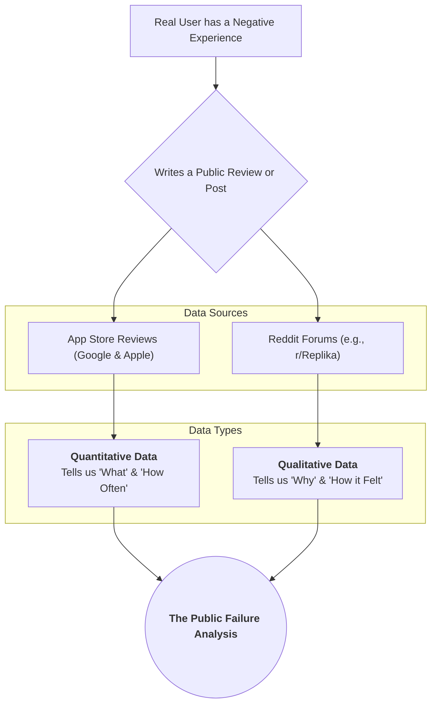

# 🔬 Our Approach: A Public Failure Analysis

To understand why mental health chatbots sometimes fail their users, a traditional
lab experiment is impractical. Instead, our project is built on a powerful
real-world model: **we treat the vast and candid corpus of public user feedback
as a direct proxy for user experience.**

Our core assumption is that a significant negative interaction—especially a
"conversational failure" where a bot feels robotic, repetitive, or unhelpful—motivates
a user to voice their frustration. We are tapping into this massive, organic dataset
to listen at scale.

## How We Model the Digital Mental Health Ecosystem

We chose a "case study" approach, selecting three distinct and highly representative
applications to model the different philosophies in this space:

1. 🤖 **The Clinical AI (`Wysa`, `Woebot`)**: These apps represent the
"AI as a Therapist" model.They are built on clinical frameworks like CBT. Analyzing
their failures tells us about the challenges of automating therapy.

2. 🫂 **The AI Companion (`Replika`)**: This represents the "AI as a Friend" model,
focused on open-ended chat and reducing loneliness. Its failures reveal the immense
difficulty of simulating genuine empathy and personality.

3. 🧘 **The Wellness Juggernaut (`Calm`)**: This app serves as our crucial **baseline**.
As a content-first wellness tool, its user complaints (e.g., cost, bugs) represent
the "background noise"of any popular app. By comparing the others against this baseline,
we can prove that themes like "robotic responses" are unique, statistically significant
problems for conversational AIs, not just general app complaints.

### Our Two-Pronged Data Strategy: The "What" and the "Why"

To build a comprehensive picture, we combine two rich data sources:

* **App Store Reviews (The Quantitative "What"):** By analyzing thousands of 1-3
star reviews, we can quantify the *prevalence* of different failure themes. This
large-scale data tells us *what* the biggest problems are and *how often* they occur.

* **Reddit Discussions (The Qualitative "Why"):** Forums like `r/Replika` are a
goldmine for deep, contextual user stories. This qualitative data provides the crucial
*why* behind the numbers, often including detailed conversational snippets and emotional
narratives that are absent from brief app reviews.

### Acknowledging the Flaws: The Limitations of Our Model

No model is perfect. By treating public data as our primary source, we inherit
its biases. We must be transparent about these limitations:

* **The Voice of the Frustrated (Selection Bias):** Our data is skewed towards
users who were motivated enough to write a negative review. The experience of silently
dissatisfied or moderately happy users is underrepresented.
* **The Anonymous User (Demographic Void):** We are analyzing the text, but we
have no information about the users themselves—their age, location, cultural background,
or clinical history.
* **Correlation, Not Causation (Observational Nature):** We can identify strong
patterns and themes of failure, but we cannot definitively prove that a
"robotic response" *caused* a user to feel worse, only that the two are strongly
correlated in their feedback.

By acknowledging these constraints, we ensure our conclusions are presented with
the appropriate nuance and scientific integrity.
