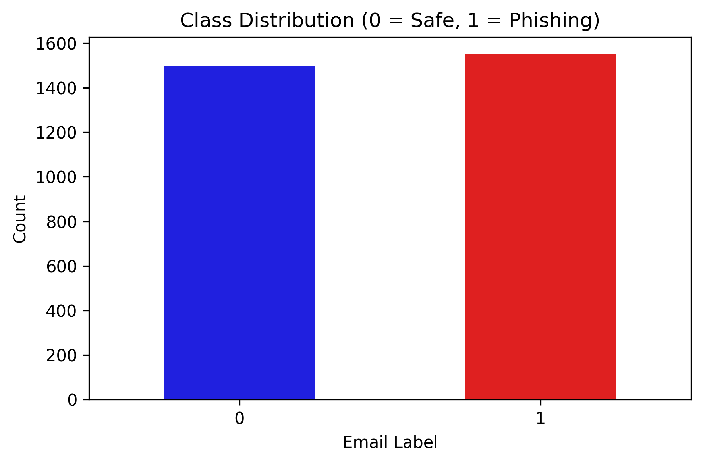
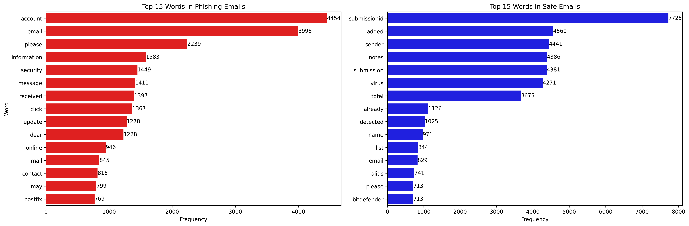
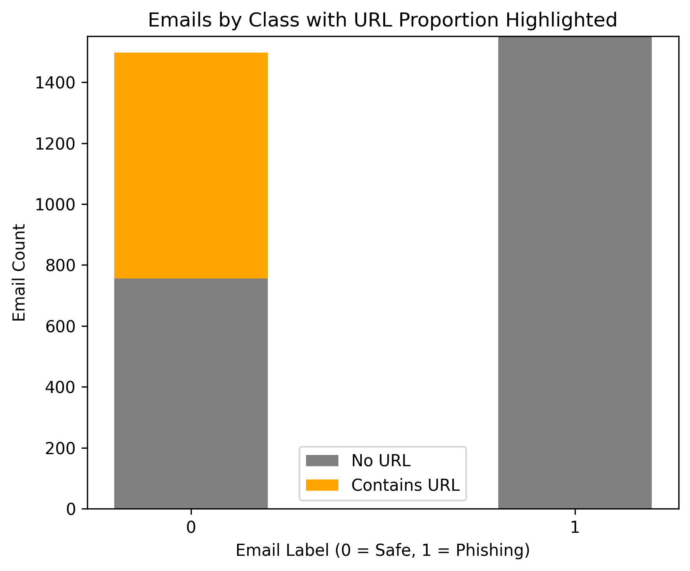

# Data Exploration

Our datset contains 1551 phishing and 1497 safe emails.Below we visually summarize the total class phishing and safe emails

Other important things we will be looking at in order to better understand our data is the frequency of words

And the existence of URL is another aspect we aim to analyze in phishing vs non phishing emails

