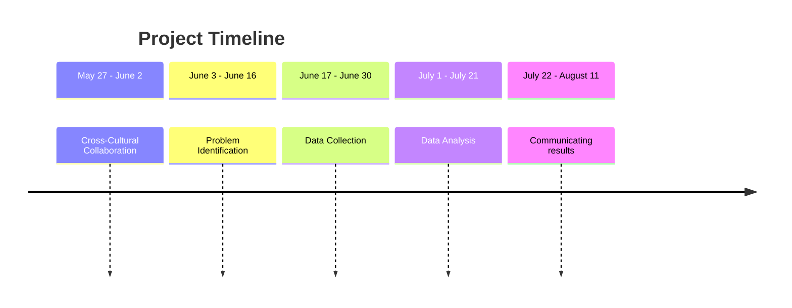

# Project title
Welcome to group 8 repo(><)  

This repository serves as a collaborative space for developing, documenting, and sharing data-driven solutions. Our goal is to apply data science techniques—such as data exploration,
preprocessing, modeling, and visualization—to gain insights and solve real-world problems.  
As the project progresses, this repository will be updated with relevant datasets, source code, results, and documentation.  
Stay tuned for more updates!
## Project Idea
----
## Timeline and milestonse

| Milestone | Focus | Status |
|----------|--------|--------|
| **0. Cross-Cultural Collaboration** | Repository setup, collaboration setup, communication planning | ✅ Completed |
| **1. Problem Identification** | Define the problem & research question | 🔄 In Progress |
| **2. Data Collection** | Decide how to model our problem domain and collect data | ⏳ Not Started |
| **3. Data Analysis** | Analyze data and interpret results | ⏳ Not Started |
| **4. Communicating Results** | Translate findings for a target audience | ⏳ Not Started |
| **5. Final Presentation** | Present the full journey and lessons learned | ⏳ Not Started |
## Repository structure

```
project
│  README.md                   # Project overview and main instructions              
|   
└───Collaboration              # Team norms, strategies, and retrospectives
│
└───Notes                      # Shared resources and learning materials
|
|___0_domain_study             # Domain research and background
|
|___1_datasets                 # Raw and processed datasets
|
|___2_data_preparation         # Scripts for cleaning and processing data
|
|___3_data_exploration         # Scripts for initial data understanding
|
|___4_data_analysis            # Scripts for in-depth analysis
|
|___5_communication_strategy   # Scripts for in-depth analysis
|
|___6_final_presentation       # Final presentation materials
```
## Team Members

- **ِ[Abdallah Alnajjar](https://github.com/theabdallahnjr)**
- **[Ahd Basan](https://github.com/ahdbasan)**
- **[Anyak](https://github.com/Anyak7)**
- **[Mariia Ermishina](https://github.com/ermishina)**
- **[Mohamed Altayeb](https://github.com/Mo-Altayeb)**
- **[Mohamed Saeed👨‍💻](https://github.com/Tbaosman)**

## 📌 Notes

This is a work in progress. More updates and details will be added soon to this readme. Stay tuned!
