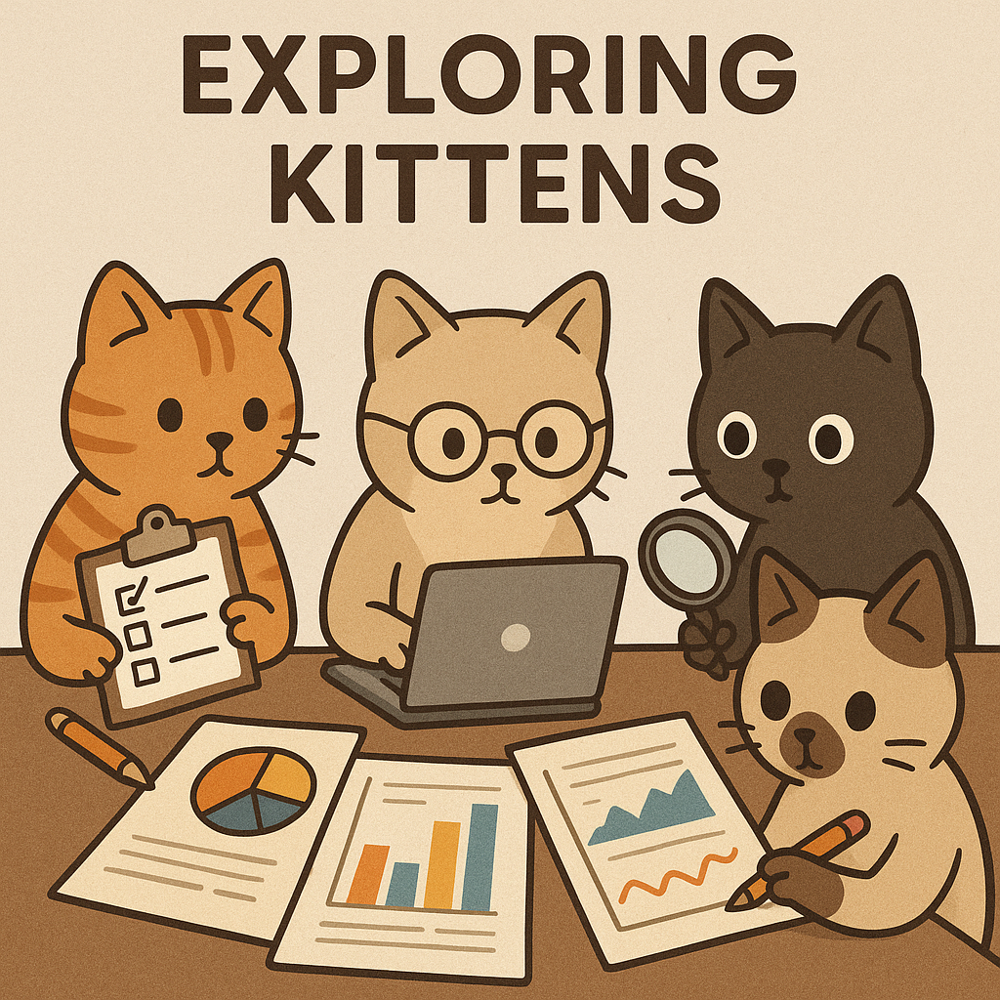

# Collaboration

## Group Norms Summary

Just like the game it is based on (Exploding Kittens), Exploring Kittens
is a fun-loving group of researchers who want to explore the world.
Our goal is to help each other, learn from one another, and grow together
as we explore the world of Computer and Data science.

## Group Agreements (Intention-Based)

- Open and respectful communication between members. Voices are not equally
loud but they are equally important.
- Consistent collaboration. We expect members to regularly participate and
contribute to the group.
We will however also be understanding if a member
needs some time off due to personal or professional commitments.
- Punctuality. We should expect to wait no more than 5 minutes for meetings
to start and people to be present.
- Curiosity. We all come from different backgrounds and places,
the only bad questions we can ask are questions that have been answered.
- Togetherness. Our group members are supportive of one another's needs, feelings
or circumstances. No one in the group is alone.
- Adaptibility. We are more focused on identifying solutions rather than
complaining about the problems or pointing fingers. We will be quick to change
our approach or methodology if need be.
- Respect. We are all human, we are all equal. We intend to value everyone's
time, commitments, and resources just like we value our own.
- Humor. Jokes are encouraged, we will strive to keep the atmosphere light
and refreshing so that meetings don't feel like a drag.
- Communication. We don't expect members to reply in real time, but
a response to messages or questions should have a reply in a day,
no more than 2 if the member is busy.
- Exploding Kittens. We will one day all play a game of Exploding Kittens
together.

## Research Question

How effective is Satellite Image Analysis at Predicting Deforestation in Malaysia?

- Research has real world implications for conservation
efforts not just in Malaysia but globally.
- Satellite image analysis is closely tied to the field of
data science and programming.
- Prediction of deforestation allows for proactive measures
for conservation rather than reactive measures.

