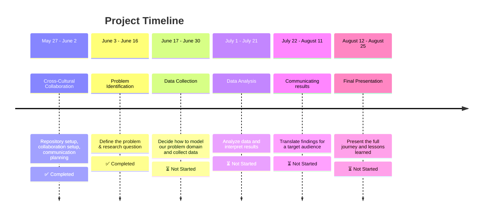

# Collaborative Data Science Project (Group 8)

Welcome to group 8 repo(><)  

This repository serves as a collaborative space for developing, documenting,
and sharing data-driven solutions. Our goal is to apply data
science techniques—such as data exploration,
preprocessing, modeling, and visualization—to gain insights and
solve real-world problems.  
As the project progresses, this repository will be updated with relevant datasets,
source code, results, and documentation.  

Stay tuned for more updates!

## Table Of contents

* [Project Domain](#project-domain)
* [Problem Statement](#problem-statement)
* [Actionable Refined Research question](#actionable--refined-research-question)
* [Timeline And Milestones](#timeline-and-milestonse)
* [Repository Structure](#repository-structure)
* [Team Members](#team-members)
* [Notes](#-notes)
* [License](#license)

## Project Domain

[](https://git.io/typing-svg)

[](https://git.io/typing-svg)

To ground our data‑driven work in real‑world context, we’ve prepared a detailed
[systems‑thinking overview](https://github.com/MIT-Emerging-Talent/ET6-CDSP-group-08-repo/blob/dc676e15aa9831b8cd7451ce91443bb873376281/0_domain_study/understanding_of_problem_domain.md)
 of the electrical power challenges in
conflict‑affected areas. It covers:

* **Patterns & trends** in how and where outages occur  
* **Underlying structures** that make the grid vulnerable  
* **Mental models** shaping decision‑making on both sides  
* **Potential interventions** from distributed solar
microgrids to local maintenance committees

<!-- markdownlint-disable MD031 MD033 MD004 MD009 MD013 MD045 -->
## Problem Statement

> Citizens in conflict-affected countries require a stable source of electricity, yet ongoing clashes and targeted attacks on power infrastructure have severely disrupted their access to reliable power.

## Actionable + Refined Research Question

> **How have armed conflicts over the past decade influenced the deployment,
> capacity utilization, and household consumption of solar photovoltaic
> systems—both environmentally and socially—in conflict-affected communities?**

## Timeline And Milestones



## Repository structure

```text

project
│  README.md                   # Project overview and main instructions        
|   
└───Collaboration              # Team norms, strategies, and retrospectives
│
└───Notes                      # Shared resources and learning materials
|
|___0_domain_study             # Domain research and background
|
|___1_datasets                 # Raw and processed datasets
|
|___2_data_preparation         # Scripts for cleaning and processing data
|
|___3_data_exploration         # Scripts for initial data understanding
|
|___4_data_analysis            # Scripts for in-depth analysis
|
|___5_communication_strategy   # Scripts for in-depth analysis
|
|___6_final_presentation       # Final presentation materials
```

## Team Members

- **ِ[Abdallah Alnajjar](https://github.com/theabdallahnjr)**
- **[Ahd Basan](https://github.com/ahdbasan)**
- **[Anyak](https://github.com/Anyak7)**
- **[Mariia Ermishina](https://github.com/ermishina)**
- **[Mohamed Altayeb](https://github.com/Mo-Altayeb)**
- **[Mohamed Saeed👨‍💻](https://github.com/Tbaosman)**

## 📌 Notes

This is a work in progress. More updates and details will be added soon to
this readme. Stay tuned!

## License

This project is licensed under the MIT License -
see the [LICENSE](https://choosealicense.com/licenses/mit/) file for details.
