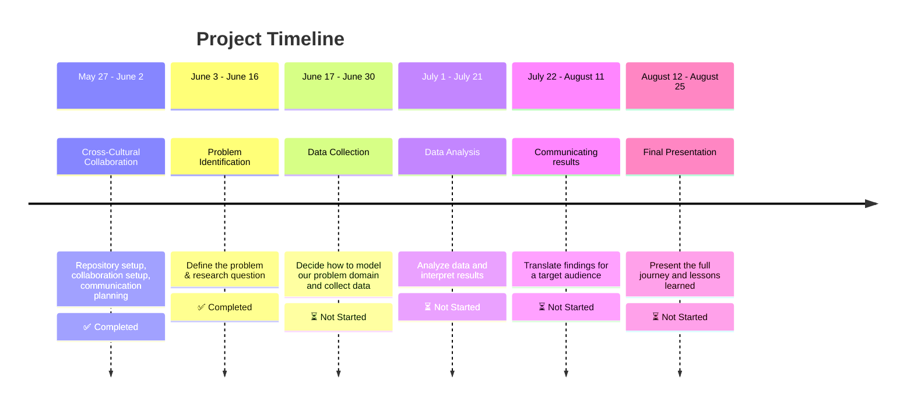

[](https://git.io/typing-svg)


</div>

[](https://git.io/typing-svg)

**Welcome aboard the CDSP Group 08- Repository!**  
_Displaced. Determined. Data-Driven._

```text
 🌌  Our Quest:
We are a team united by purpose and shaped by displacement,  
 using data science to drive real-world impact.
This project applies techniques like data exploration, modeling,  
 and visualization to explore how renewable energy especially solar  
can bring resilience and hope to conflict-affected communities.
```


# [System Thinking](https://github.com/MIT-Emerging-Talent/ET6-CDSP-group-08-repo/blob/main/0_domain_study/understanding_of_problem_domain.md)

To ground our data‑driven work in real‑world context, we’ve prepared a detailed
[systems‑thinking overview](https://github.com/MIT-Emerging-Talent/ET6-CDSP-group-08-repo/blob/dc676e15aa9831b8cd7451ce91443bb873376281/0_domain_study/understanding_of_problem_domain.md)
 of the electrical power challenges in
conflict‑affected areas. It covers:

* **Patterns & trends** in how and where outages occur  
* **Underlying structures** that make the grid vulnerable  
* **Mental models** shaping decision‑making on both sides  
* **Potential interventions** from distributed solar
microgrids to local maintenance committees

<!-- markdownlint-disable MD031 MD033 MD004 MD009 MD013 MD045 -->
# [Problem Statement](0_domain_study/understanding_of_problem_domain.md)

> Citizens in conflict-affected countries require a stable source of electricity, yet ongoing clashes and targeted attacks on power infrastructure have severely disrupted their access to reliable power.

# [Actionable + Refined Research Question](0_domain_study/progress.md)

> **How have armed conflicts over the past decade influenced the deployment,
> capacity utilization, and household consumption of solar photovoltaic
> systems—both environmentally and socially—in conflict-affected communities?**



## Repository structure

```text
project/
│  README.md                  # Start here! Everything important in one file.
│
├── 0_domain_study/          #  Problem background & context
├── 1_datasets/              #  Raw + cleaned data
├── 2_data_preparation/      #  Scripts for cleaning and prepping data
├── 3_data_exploration/      #  Visualizations & summaries
├── 4_data_analysis/         #  Modeling, testing, interpreting
├── 5_communication_strategy/#  Translation of findings to stakeholders
├── 6_final_presentation/    #  Final delivery magic
└── Collaboration/           #  Team norms, syncs, retrospectives
```

## Team Members


_Who's behind all this?_

- **ِ[Abdallah Alnajjar](https://github.com/theabdallahnjr)**
- **[Ahd Basan](https://github.com/ahdbasan)**
- **[Anyak](https://github.com/Anyak7)**
- **[Mariia Ermishina](https://github.com/ermishina)**
- **[Mohamed Altayeb](https://github.com/Mo-Altayeb)**
- **[Mohamed Saeed👨‍💻](https://github.com/Tbaosman)**

##  Notes

This is a work in progress. More updates and details will be added soon to
this readme. Stay tuned!

## License

This project is licensed under the MIT License -
see the [LICENSE](https://github.com/MIT-Emerging-Talent/ET6-CDSP-group-08-repo/blob/main/LICENSE) file for details.

